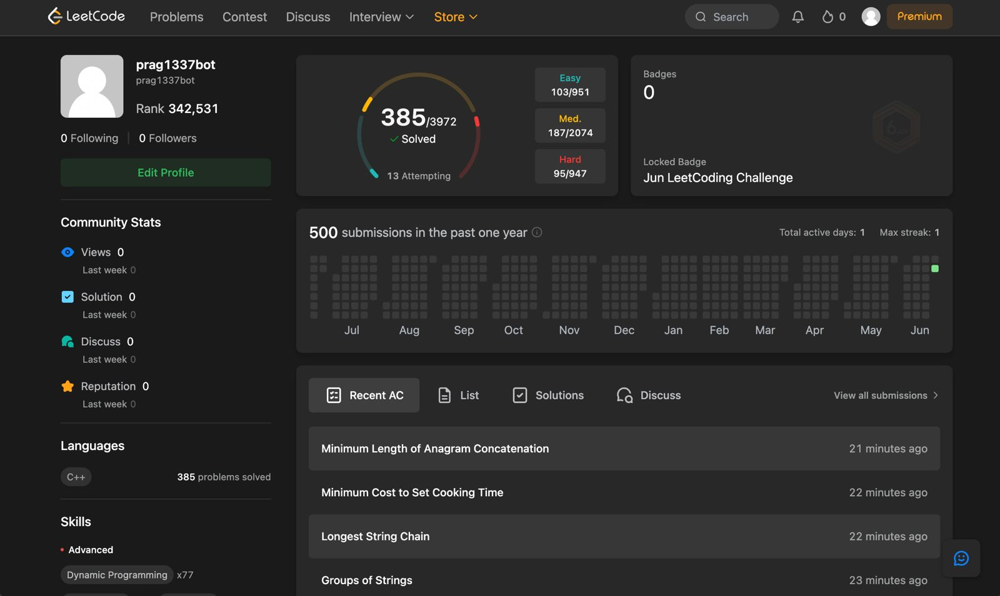

# 1337 Bot

An automated Python script that types and submits LeetCode solutions directly into your browser. Check out the profile it was deployed on [here](https://leetcode.com/u/1337bot/).

### Overview

LeetCode grinding has become a repetitive, robotic chore for many developers who treat problem counts like high scores rather than actual skill metrics. **1337 Bot** was built as a fun, satirical experiment to critique this exact culture.

The script connects to an already open Google Chrome window, reads pre-written C++ solutions from the popular `kamyu104` GitHub repository, opens the corresponding LeetCode page, clears the text editor, pastes the solution using keyboard shortcuts, and clicks submit. 

To keep the final score completely precise, a separate tracker script runs alongside it to act as an automated kill-switch.

---

### How the System Works

The project runs two Python scripts simultaneously:

#### 1. The Submitter (`submitter.py`)
* **What it Does:** Handles all the browser navigation, clicking, and typing.
* **How it Works:** It connects to Chrome using a local debugging port. It looks into a folder containing over 3,500 C++ solutions, cleans up execution boilerplate, and navigates the browser to that problem's URL. It mimics standard user inputs by pressing `Cmd+A` to select all text, hitting `Backspace`, pasting the code via the system clipboard, and pressing the "Submit" button.

#### 2. The Live Watchdog (`watchdog.py`)
* **What it Does:** Monitors the live account score to enforce a hard stop.
* **How it Works:** Every 10 seconds, this script queries LeetCode's public data gateway to read the total solved number. The exact moment the profile hits a set number of unique solved questions, it triggers a system command to instantly kill the submitter script so it doesn't go a single digit over the target.

---

### The Experiment Process

#### Phase 1 — Strategy and Data Sourcing
The original concept involved scraping solutions on the fly, but web layouts proved too slow and fragile. The project was shifted to use a local copy of `kamyu104`'s repository of C++ solutions.

#### Phase 2 — Adjusting for Network Latency
During live runs on slow internet, the bot initially typed too fast before the website could finish loading the text window. This resulted in blank text submissions and compilation errors. The script was updated to give the browser up to 1 second to fully render the code editor before trying to execute the typing sequence.

#### Phase 3 — Hitting Server Boundaries
The bot operated smoothly at about 2 submissions per minute. After 500 total submissions and solving **385 questions** in 3 hours, LeetCode's backend triggered a temporary server-side rate limit penalty.

---

### Repository Files

* `submitter.py`: The main script that controls the browser window, handles file inputs, and executes submissions.
* `watchdog.py`: The independent tracking process that watches the profile statistics and stops the run at the exact milestone.
